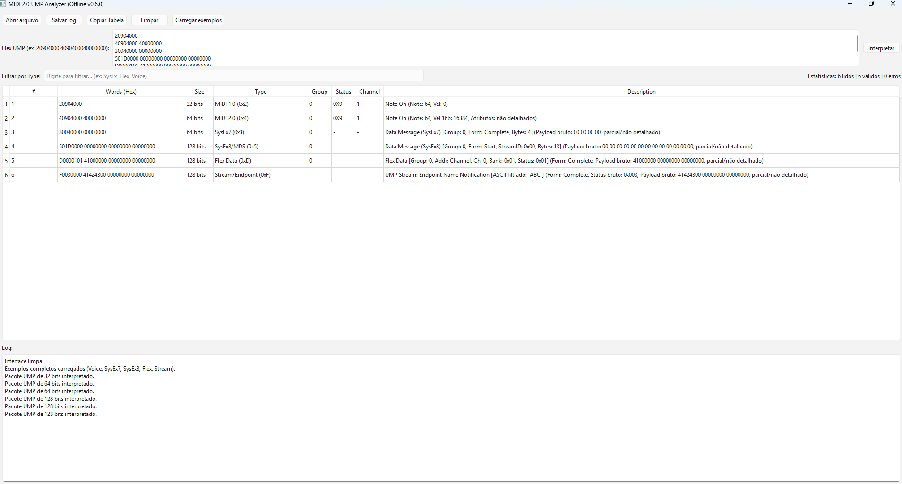
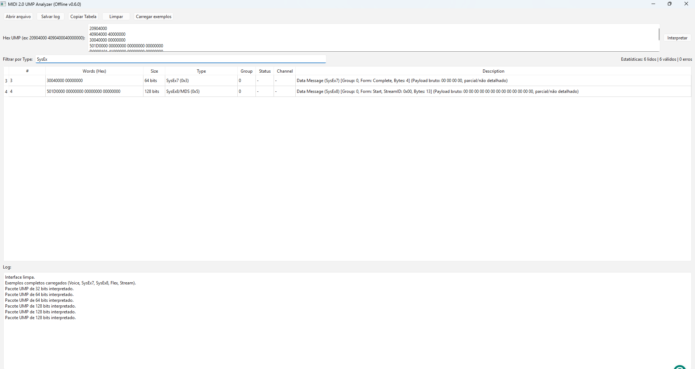

# MIDI 2.0 Workbench Port (C++ / Qt6)


**Versão:** v1.5.1 - Comments Parsing Support

## Visão Geral do MVP
O **MIDI 2.0 Workbench Port** é um **Analisador Offline Estático de Universal MIDI Packets (UMP)** construído em C++ e interface nativa Qt6. 

**O que este projeto FAZ:**
- Ingestão passiva de registros textuais UMP brutos (aceita blocos hexadecimais colados na interface ou leitura de arquivos `.txt`).
- Desmembramento matemático e detalhamento estático dos cabeçalhos dos Message Types:
  - MT 0x2 (MIDI 1.0 Channel Voice)
  - MT 0x4 (MIDI 2.0 Channel Voice)
  - MT 0x3 (SysEx7 - Cabeçalho Parcial)
  - MT 0x5 (SysEx8/MDS - Cabeçalho Parcial)
  - MT 0xD (Flex Data - Cabeçalho Parcial)
  - MT 0xF (UMP Stream - Descobertas Endpoint, Função e Dispositivo)
- Sanitização de dados robusta, rastreando lixo textual, letras inválidas, arquivos obesos ou contagem de bytes quebrada no vetor sem travar.

**O que este projeto NÃO FAZ (Limitações Conhecidas):**
- **NÃO é um MIDI Host real.** Ele não conecta, não envia e não ouve dispositivos MIDI 1.0 / 2.0 físicos pelo Windows.
- **NÃO suporta Windows MIDI Services ou Drivers USB.**
- **NÃO implementa MIDI-CI** (Property Exchange, Profile Configuration, Protocol Negotiation). As interpretações de payload são brutas ou estáticas.
- **NÃO reconstrói fragmentação UMP**. Pacotes SysEx ou Flex partidos em pacotes menores (Start/Continue/End) são avaliados isoladamente pacote por pacote de forma forense, sem concatenação temporária de estado (buffer state).

## Download
Para testar a aplicação sem precisar compilar o código fonte, acesse a aba lateral [**Releases**](https://github.com/LucasRamosSilva-15/MIDI2.0WorkbenchPortCpp-Qt/releases) aqui no GitHub.
Lá você poderá baixar o pacote `.zip` compactado (ex: `MidiUmpAnalyzer-v1.1.0-windows-x64.zip`) gerado e empacotado automaticamente pelos servidores da Microsoft, contendo o executável livre de vírus e todas as DLLs necessárias para rodar no seu Windows.

## Screenshots

- 
- 

## Como Usar

O analisador é projetado para aceitar registros hexadecimais brutos e dissecá-los de forma imediata:
1. **Entrada Manual**: Cole seus pacotes UMP hexadecimais diretamente na caixa de texto superior. Letras e espaços perdidos serão higienizados de forma inteligente.
2. **Entrada de Arquivos**: Se preferir, clique no botão `Load .txt` e carregue um arquivo de log da sua máquina contendo pacotes brutos.
3. **Analisar**: Pressione o botão `Interpret` para que a tabela preencha as traduções descritivas instantaneamente.
4. **Filtrar**: Utilize a barra de **Filter** para pesquisar pacotes específicos (ex: digite "SysEx" e a tabela mostrará apenas mensagens SysEx).
5. **Copiar Dados**: Clique no botão `Copy Table` para transportar toda a grade decodificada para o seu Excel/Bloco de notas em um formato perfeitamente tabulado.
6. **Extrair o Log**: Pressione `Save Log` para guardar os relatórios e logs de erro (truncamentos, arquivos inválidos) em um arquivo `.txt` na sua máquina.

## Infraestrutura Tecnológica (Testes e CI)
A versão `v1.1.0` suporta testes nativos puramente C++, desacoplados da interface gráfica Qt:
- **Automação de Testes Local (`UmpParserTests`)**: Cobertura paramétrica contra pacotes mentirosos, sujeira alfanumérica e validação semântica de MT.
- **GitHub Actions (CI / CD)**:
  - A cada *commit/push* normal, a nuvem Windows analisa a robustez binária usando testes automáticos.
  - A cada *Tag* postada na branch (`v*`), a nuvem engatilha o **Release Worklflow**, empacotando o executável estático junto das DLLs requeridas via `windeployqt` e gerando automaticamente o pacote `.zip` de lançamento na aba de Releases.

## Instruções de Build Local

Para compilar manualmente na sua máquina Windows utilizando MSVC 2022:
1. Tenha o Qt6 configurado e exposto na sua variável `CMAKE_PREFIX_PATH`.
2. Em um terminal / PowerShell na raiz, digite:
   ```powershell
   cmake -B build -DCMAKE_BUILD_TYPE=Release
   cmake --build build --config Release
   ```
3. Execute o app em: `build\Release\MidiUmpAnalyzer.exe`

## Instruções de Testes Locais

Rode os testes passivos independentes via PowerShell:
```powershell
powershell -ExecutionPolicy Bypass -File tests\run_tests.ps1
```
*(Você pode usar a flag opcional `-SkipBuild` caso já tenha rodado o CMake antes e queira apenas os resultados do binário).*

## Roadmap
O que esperar para as próximas evoluções (*Pós-MVP*):
- Investigação controlada para integração com interfaces UMP MIDI via OS (Windows MIDI Services).
- Injeção de estado isolado para reconstrução *stateless* em tempo real de mensagens UMP fragmentadas (SysEx, Flex).
- Parser avançado de dados proprietários sem corromper a leitura bruta existente.
