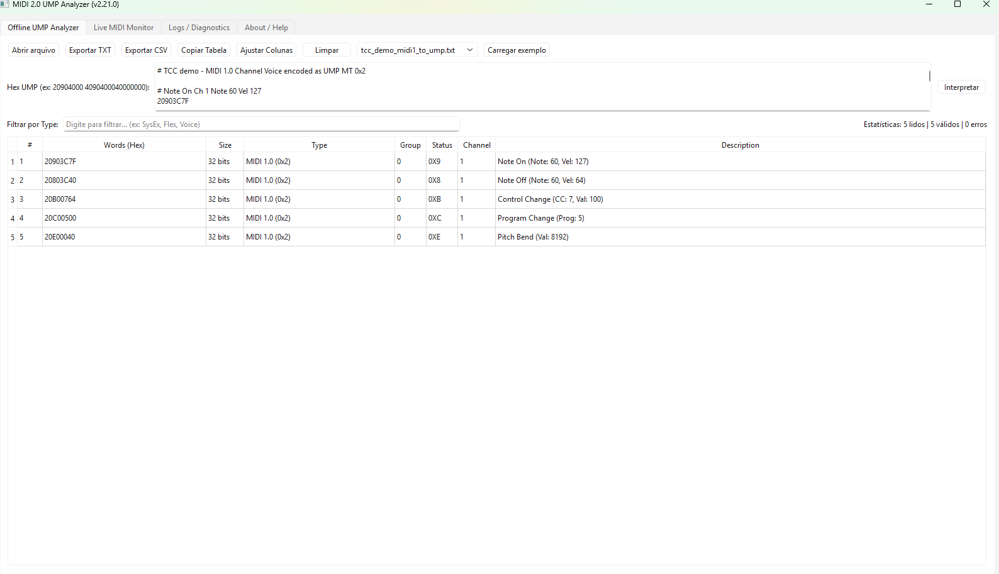
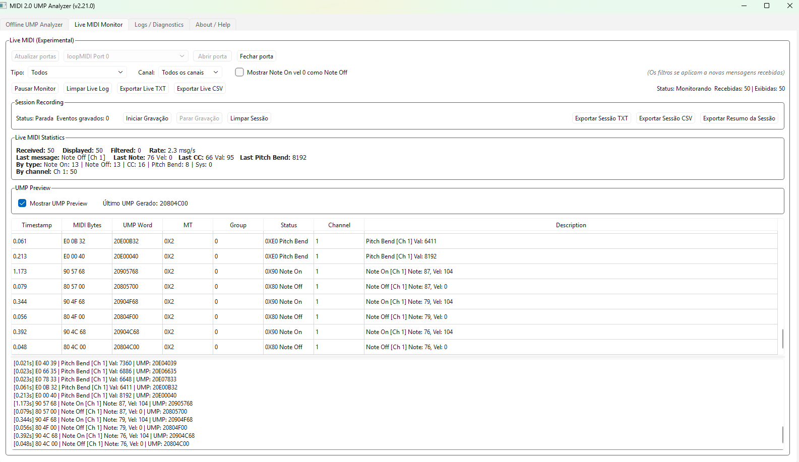

# MidiUmpAnalyzer / MIDI 2.0 Workbench Port (v4.24.0)


**Current version:** v4.24.0

## Descrição curta
Ferramenta em C++/Qt para análise de Universal MIDI Packet, monitoramento MIDI 1.0, UMP Preview MT 0x2 e pesquisa experimental de backend UMP nativo.
Foi criado para validar pacotes MIDI 2.0 (como SysEx8 e Flex Data) gerados por MCUs embarcados (como Raspberry Pi Pico) antes do transporte USB final.

## Estado atual
- **Offline UMP Analyzer**: funcional.
- **Live MIDI Monitor via RtMidi**: opcional, MIDI 1.0 bytes crus.
- **MIDI 1.0 to UMP Preview**: funcional como MT 0x2.
- **Experimental UMP Backend**: funcional com FakeUmpInputBackend.
- **Fake UMP Session Recording/Summary**: funcional.
- **WindowsMidiServicesBackend**: Integração Estável de Produção (TCC Master Release).
- **Real Windows MIDI Services endpoint listing**: funcional via C++/WinRT.
- **Real UMP capture**: funcional via C++/WinRT.

## Important limitations
- O componente RtMidi **não é** um backend UMP real.
- O UMP Preview do Live MIDI usa MT 0x2, não realiza conversão completa para propriedades MT 0x4 de alta resolução.
- O `FakeUmpInputBackend` não captura hardware real. Ele injeta arrays hexadecimais in-memory para validação da Interface Gráfica.
- Protocolos MIDI-CI (Property Exchange, Profile Configuration, Protocol Negotiation) não estão implementados ativamente.
- O Windows MIDI Services SDK **não é** uma dependência obrigatória nesta versão base, o *build* permanece independente via Triunvirato.

## Version lines
- **v1.x:** Offline UMP Analyzer.
- **v2.x:** Live MIDI + UMP Preview.
- **v3.x:** Experimental Fake UMP Backend, recording, exports, summary, TCC-ready.
- **v4.x:** Native UMP backend research, Windows MIDI Services skeleton/endpoint listing research.

## Windows MIDI Services SDK experiment
- A versão **v4.3.0** adiciona a flag experimental CMake de *Build Opcional* (`ENABLE_WINDOWS_MIDI_SERVICES_SDK_EXPERIMENT`).
- A diretiva nasce **OFF** por padrão.
- **Não** ativa captura de Kernel nem de Endpoint Listing real neste momento.
- A compilação diária **não necessita** dessa rotina. Para fins avaliativos de TCC/Banca, a trilha estática e os pacotes *RtMidi/Fake backend* operam com autonomia absoluta.

## Windows MIDI Services SDK detection research
- Em **v4.4.0** expandimos o sistema acoplando um diagnóstico de detecção de ambiente.
- O diagnóstico é *compile-time/report* e não realiza invasões locais (`vcpkg`, Registro Windows, Busca em Pastas).
- O relatório não detecta o SDK físico nem acopla `<winrt>`. O projeto se resguarda focado 100% na segurança e estabilidade dos ambientes limitados em recursos.

## Windows MIDI Services optional package detection
- Na **v4.5.0** nós preparamos os campos e a documentação C++ para detectar pacotes/headers no futuro.
- Ainda não detecta pacotes reais nem ativa a *projection* C++/WinRT ou `<winrt/Windows.Devices.Midi2.h>`.
- Os testes experimentais em C++ da API da Microsoft foram separados num módulo isolado (`tests/WindowsMidiServicesBackendTests.cpp`).

## Windows MIDI Services user-provided SDK root research
- A **v4.6.0** adiciona a variável opcional `WINDOWS_MIDI_SERVICES_SDK_ROOT`.
- Esse caminho não ativa o SDK real, tampouco realiza endpoint listing ou captura de UMP.
- A build normal continua limpa e blindada sem SDK.

## Windows MIDI Services optional header detection
- Na **v4.7.0** o compilador usa a variável `WINDOWS_MIDI_SERVICES_SDK_ROOT` para tentar parear *headers* candidatos passivamente.
- O campo de detecção restringe-se exclusivamente à pasta informada (Nenhuma vasculha agressiva de disco é feita).
- Headers encontrados ainda não são consumidos e o Endpoint Listing real continua isolado.

## Windows MIDI Services optional header include compile experiment
- Na **v4.8.0**, se um caminho válido foi passado na detecção, é testada a compilação cruzada do `__has_include(<Windows.Devices.Midi2.h>)`.
- A API da MS nunca é chamada de fato; testamos unicamente o link pré-processador do C++.
- A UI não foi plugada aos resultados nativos, mantendo a estabilidade.

## Windows MIDI Services SDK candidate discovery correction
- Na **v4.9.0** procuramos nomes mais realistas fornecidos pelo pacote `vcpkg`:
  - `Microsoft.Windows.Devices.Midi2.winmd`
  - `Microsoft.Windows.Devices.Midi2.h`
  - `winrt/Microsoft.Windows.Devices.Midi2.h`
- A busca continua restrita ao `WINDOWS_MIDI_SERVICES_SDK_ROOT`;
- O resultado é *non-fatal*;
- WinMD detectado não ativa endpoint listing;
- Header detectado não ativa API real;
- A build normal continua limpa (*SDK-free*).

## Windows MIDI Services API type reference compile experiment
- Na **v4.10.0** adicionou-se a flag opcional `ENABLE_WINDOWS_MIDI_SERVICES_TYPE_REFERENCE_EXPERIMENT` (`OFF` por padrão).
- Só entra em efeito com um Root válido e Header Detectado.
- Testa *unicamente* a compatibilidade de compilação C++ cruzada contra a API da MS.
- Não há instância nativa. Não há Endpoint listing. Não há captura UMP. 
- A build padrão permanece *SDK-free*.
- Exemplo experimental:
```powershell
cmake -B build-wms-sdk-root -G "Visual Studio 17 2022" -A x64 -DCMAKE_PREFIX_PATH="C:\Qt\6.11.1\msvc2022_64" -DENABLE_WINDOWS_MIDI_SERVICES=ON -DENABLE_WINDOWS_MIDI_SERVICES_SDK_EXPERIMENT=ON -DENABLE_WINDOWS_MIDI_SERVICES_HEADER_INCLUDE_EXPERIMENT=ON -DENABLE_WINDOWS_MIDI_SERVICES_TYPE_REFERENCE_EXPERIMENT=ON -DWINDOWS_MIDI_SERVICES_SDK_ROOT="C:\vcpkg\installed\x64-windows"
cmake --build build-wms-sdk-root --config Release
```

## Windows MIDI Services production hardening
- A **v4.22.0** foca na estabilização final do experimento nativo.
- Proteções contra exceções COM (`try/catch` para `winrt::hresult_error`) e teardown seguro aplicados ao `WindowsMidiServicesBackend`.
- O `MidiInputController` agora possui exclusão mútua (`std::mutex`) blindando contra *rapid hot-swaps*.

## Screenshots
- 
- 

## Build
Para compilar localmente na sua máquina Windows utilizando MSVC 2022.

**Build Padrão (Offline / Fake Backend):**
```powershell
cmake -B build -G "Visual Studio 17 2022" -A x64 -DCMAKE_PREFIX_PATH="C:\Qt\6.11.1\msvc2022_64"
cmake --build build --config Release
```

**Build RtMidi (Live MIDI 1.0):**
```powershell
cmake -B build-rtmidi -G "Visual Studio 17 2022" -A x64 -DCMAKE_PREFIX_PATH="C:\Qt\6.11.1\msvc2022_64" -DENABLE_RTMIDI=ON
cmake --build build-rtmidi --config Release
```

**Build Skeleton Windows MIDI Services:**
*(Nota: a flag ENABLE_WINDOWS_MIDI_SERVICES=ON ainda não ativa SDK real, apenas compila a casca skeleton protegida).*
```powershell
cmake -B build-wms -G "Visual Studio 17 2022" -A x64 -DCMAKE_PREFIX_PATH="C:\Qt\6.11.1\msvc2022_64" -DENABLE_WINDOWS_MIDI_SERVICES=ON
cmake --build build-wms --config Release
```

## Tests
Automação unitária nativa em terminal (não requer interface):
```powershell
powershell -ExecutionPolicy Bypass -File tests\run_tests.ps1
```

## Packaging
Zips de lançamento podem ser empacotados com scripts locais acoplados nativamente (A Tríade):
```powershell
powershell -ExecutionPolicy Bypass -File scripts\package_release.ps1 -Version v4.24.0
powershell -ExecutionPolicy Bypass -File scripts\package_release.ps1 -Version v4.24.0 -EnableRtMidi
powershell -ExecutionPolicy Bypass -File scripts\package_release.ps1 -Version v4.24.0 -EnableWms
```

## Docs
Manuais oficiais e cadernos de auditoria dispostos no repositório:
- [docs/tcc_final_demo_script.md](docs/tcc_final_demo_script.md)
- [docs/experimental_ump_backend_demo_guide.md](docs/experimental_ump_backend_demo_guide.md)
- [docs/native_ump_backend_feasibility.md](docs/native_ump_backend_feasibility.md)
- [docs/windows_midi_services_feasibility.md](docs/windows_midi_services_feasibility.md)
- [docs/v4_backend_roadmap.md](docs/v4_backend_roadmap.md)
- [docs/release_summary_v4.md](docs/release_summary_v4.md)
- [docs/release_summary_v4_final.md](docs/release_summary_v4_final.md)
